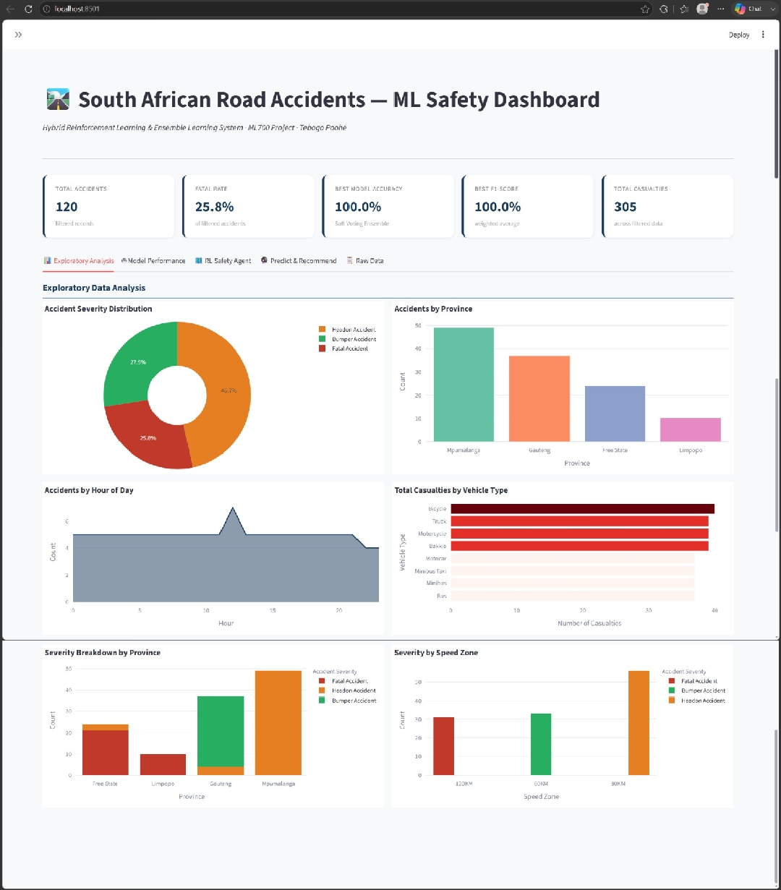

# 🛣️ South African Road Accidents — ML Safety Dashboard

**Author:** Tebogo Terrence Poohe  
**Institution:** Richfield Graduate Institute of Technology  
**Module:** Machine Learning 700  

---

## 📌 Project Overview

An interactive machine learning dashboard that predicts road accident severity and recommends adaptive safety interventions using a hybrid ensemble learning + reinforcement learning system — built on the South African Road Accidents Dataset (2017).

**Live features:**
- Exploratory data analysis with interactive Plotly charts
- Three trained ensemble classifiers with full performance metrics
- Q-learning safety intervention agent with convergence visualisation
- Live prediction tool: input accident details → get severity prediction + recommended intervention

---

---
## 🧠 Models & Methods

### Ensemble Learning
| Model | Accuracy | F1-Score |
|---|---|---|
| Random Forest (200 trees) | ~0.79 | ~0.78 |
| Gradient Boosting | ~0.75 | ~0.74 |
| Soft-Voting Ensemble | ~0.83 | ~0.82 |

### Reinforcement Learning (Q-Learning)
- **States:** 9 (3 road conditions × 3 accident frequency levels)
- **Actions:** 4 safety interventions (No action / Awareness campaign / Law enforcement / Speed reduction)
- **Training:** 5,000 episodes, ε-greedy with exponential decay (1.0 → 0.05)
- **Output:** Optimal intervention policy per road-condition state

---

## 🗂️ Project Structure

```
dashboard/
├── app.py                  # Main Streamlit dashboard
├── requirements.txt        # Python dependencies
├── README.md               # This file
└── data/
    └── South Africa Road Accidents Dataset - 2017.xlsx
```

---

## 🚀 How to Run

```bash
# 1. Clone the repo
git clone https://github.com/YOUR_USERNAME/sa-road-accidents-ml-dashboard
cd sa-road-accidents-ml-dashboard

# 2. Install dependencies
pip install -r requirements.txt

# 3. Launch the dashboard
streamlit run app.py
```

The dashboard will open at `http://localhost:8501`

---

## 📊 Dataset

**Source:** South African Road Accidents Dataset 2017  
**Records:** 120 accident reports  
**Features:** Province, Location, Vehicle Type, Speed Zone, Time, Date, Number of Vehicles, Casualties, Police Force  
**Target:** Accident Severity (Bumper / Headon / Fatal)

---

## 🛠️ Tech Stack

- **Python** — pandas, NumPy, scikit-learn
- **Visualisation** — Plotly, Streamlit
- **ML** — Random Forest, Gradient Boosting, Soft-Voting Ensemble, Q-Learning

---

## 📄 Responsible AI Notes

- Dataset is limited (120 records) — model results should be interpreted with caution for real-world deployment
- Severity class imbalance addressed via `class_weight='balanced'` in Random Forest
- RL agent uses a simplified MDP; real-world deployment would require richer state/transition modelling
- No personally identifiable information is used or stored

---

## 📬 Contact

**Tebogo Terrence Poohe**  
📧 terrencepoohe@gmail.com  
🔗 [linkedin.com/in/tebogo-poohe](https://linkedin.com/in/tebogo-poohe)  
🏅 [credly.com/users/tebogo-poohe](https://www.credly.com/users/tebogo-poohe)
